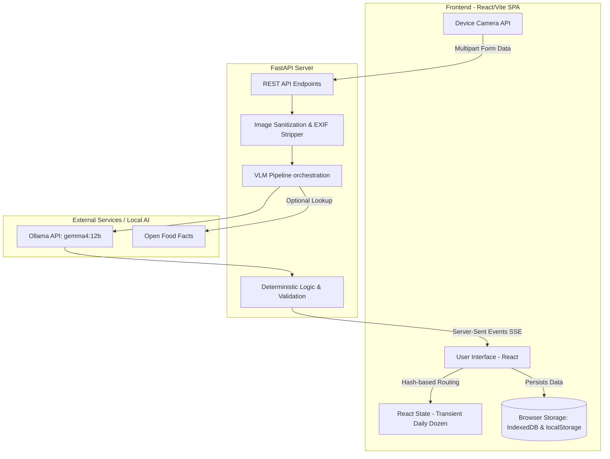
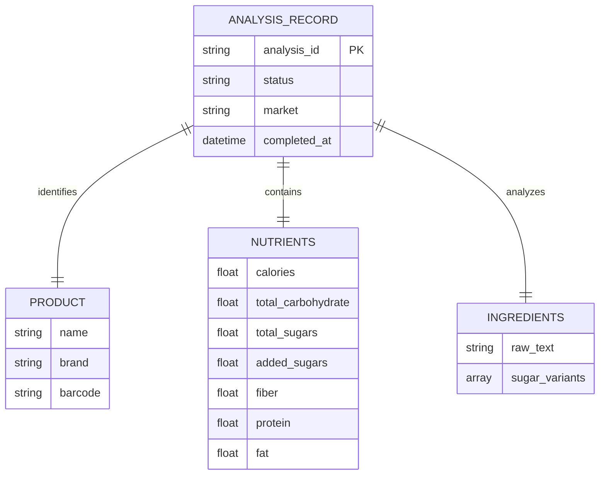

# System Architecture

NutritionTracker utilizes a decoupled architecture combining a Vite/React Single Page Application (SPA) with a FastAPI backend dedicated to Vision-Language Model processing.

## High-Level System Design

## Frontend-to-Backend Data Flow
1. **Capture:** The React frontend captures photos (Nutrition Facts, Ingredients) via `navigator.mediaDevices.getUserMedia`.
2. **Submission:** Images are bundled with market and barcode data into a `multipart/form-data` payload and POSTed to `/api/v1/analyses`.
3. **Processing Job:** The FastAPI backend creates a short-lived asynchronous job (tracking state in memory) and saves sanitized images to a temporary directory.
4. **Streaming Updates:** The frontend subscribes to Server-Sent Events (SSE) at `/api/v1/analyses/{id}/events`. As the backend orchestrates the VLM and validation logic, real-time status updates stream back to the UI.
5. **Finalization:** Once processing is complete, the frontend POSTs a confirmation to `/api/v1/analyses/{id}/finalize`, receiving the deterministically validated JSON record.
6. **Persistence:** The frontend stores this final validated record in the browser's IndexedDB.

## Database Schemas and Relationships

Since the application is local-first, there is no traditional relational database. 

### Local Storage (`localStorage`)
- **`daily_dozen_recipes`**: Stores an array of JSON objects representing custom recipes (ID, name, calories, ingredients, Daily Dozen serving values).

### IndexedDB Schema (Sugar pAI History)
The `sugar-pai-db` IndexedDB database stores confirmed label scans.

## Third-Party API Integrations and Service Boundaries
- **Ollama (`/api/generate`):** The primary VLM engine. Runs locally, ensuring no image data leaves the user's network unless configured otherwise.
- **Open Food Facts (Optional):** If `SUGAR_PAI_ENABLE_OFF_LOOKUP=true`, the backend will perform a fast, external lookup via barcode to cross-reference or retrieve missing label data.