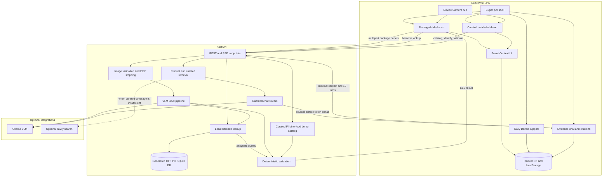
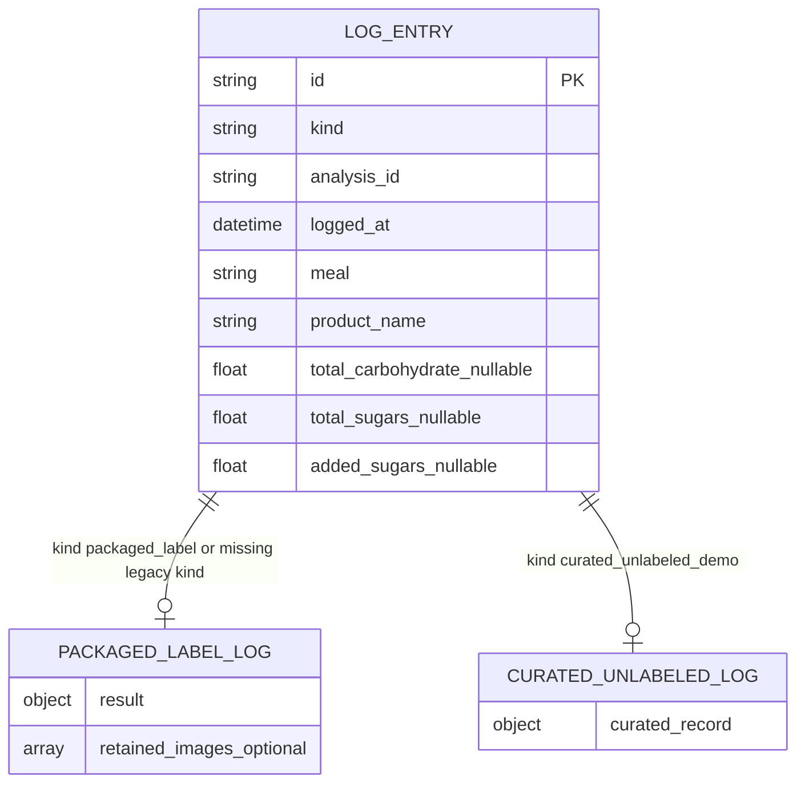

# System Architecture

Sugar pAI V2 uses a Vite/React SPA with a FastAPI backend. The product is local-first: the backend performs short-lived analysis and validation, while confirmed history is stored in browser IndexedDB.

## High-Level System Design

## Packaged-Label Data Flow

1. User scans or types a UPC/EAN barcode. The frontend calls `GET /api/v1/off-products/{barcode}?market=PH`, and the backend resolves exact plus UPC-A / zero-prefixed EAN-13 aliases before returning the canonical database barcode.
2. If the local Open Food Facts row is complete, the frontend calls `POST /api/v1/analyses/barcode` and opens review without requiring images.
3. If the local row is partial or missing, the user captures Nutrition Facts, ingredients, and front-label panels as needed.
4. Frontend quality checks run locally.
5. Frontend creates an image-based analysis job with `POST /api/v1/analyses`.
6. Backend sanitizes uploads, checks the local OFF database first, runs the VLM only when label photos are needed, classifies ingredients, checks claims, and streams events.
7. User corrects draft evidence in the review screen.
8. Frontend finalizes with `POST /api/v1/analyses/{id}/finalize`.
9. Backend returns a confirmed `AnalysisResult`.
10. Frontend builds Smart Context and saves the local `packaged_label` log.

## Curated Unlabeled Demo Data Flow

1. User chooses **Unlabeled demo**.
2. Frontend loads `GET /api/v1/unlabeled-foods/catalog?market=PH`.
3. User may upload a food photo; `POST /api/v1/unlabeled-foods/identify` can suggest catalog candidates.
4. User confirms catalog food and portion manually.
5. Frontend validates with `POST /api/v1/unlabeled-food-records/validate`.
6. Backend returns a `CuratedFoodRecord` with qualitative tags, context flags, unavailable glycemic evidence, and limitations.
7. Frontend builds Smart Context and saves the local `curated_unlabeled_demo` log.

## Local Data Model

### IndexedDB

Database: `sugar-pai-research`

Store: `logs`

Store: `chatThreads` (schema version 2)

Chat threads contain an automatic or user-edited title, timestamps, an optional minimal validated-product context, messages, and immutable source snapshots. Threads never leave IndexedDB as a durable server record; only the current request, selected context, and up to ten prior turns are sent for transient generation.

Log records are union-shaped:

Missing `kind` is treated as `packaged_label` for backward compatibility.

### localStorage

Daily Dozen support state and custom recipes remain local to the browser.

## Service Boundaries

- **FastAPI backend:** No durable user database. Analysis jobs and uploads expire after 15 minutes.
- **Generated local OFF database:** `backend/app/data/off_ph_products.db` is a static SQLite artifact generated from `research/openfoodfacts_export.csv`. It supports offline barcode lookup for `market=PH`; raw CSV is not required at runtime.
- **Ollama:** Optional VLM provider for packaged-label extraction.
- **Evidence chat:** Safety and scope rules run before retrieval. Retrieval orders direct product evidence, ranked curated fragments, and optional authoritative-domain Tavily results. Ollama receives only the selected evidence and is instructed to cite it.
- **Tavily:** Optional live search used only when curated coverage is insufficient. Results outside the FDA, WHO, University of Sydney GI, Diabetes Care, NCBI/PMC, and Open Food Facts domain allowlist are discarded.
- **Open Food Facts data:** Community data is used as database evidence only. Complete matches can prefill review, and partial matches can act as fallback evidence, but user confirmation remains required before logging.
- **Curated catalog:** Static qualitative demo data only. It does not contain calories, macros, GI, GL, or FNRI-derived claims.

## Safety Boundary

Smart Context is deterministic educational context. It does not provide medical advice, medication guidance, insulin guidance, suitability claims, or glucose predictions.
