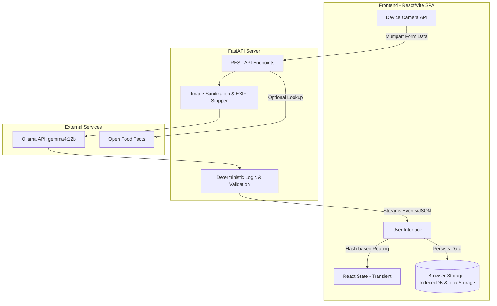

# System Architecture

NutritionTracker utilizes a decoupled architecture combining a Vite/React Single Page Application (SPA) with a FastAPI backend dedicated to Vision-Language Model processing 

## High-Level System Design

## Data Flow & State Boundaries

* Frontend-to-Backend: Label photos, ingredient images, and barcodes are captured via navigator.mediaDevices.getUserMedia or file upload, and sent as multipart form data to the backend
* Local Persistence: The application operates without a centralized cloud database Custom recipes write to localStorage (daily_dozen_recipes), while confirmed Sugar pAI records write to IndexedDB
* Service Boundaries: The FastAPI service handles short-lived, in-memory analysis jobs and purges temporary images upon job completion or route transition