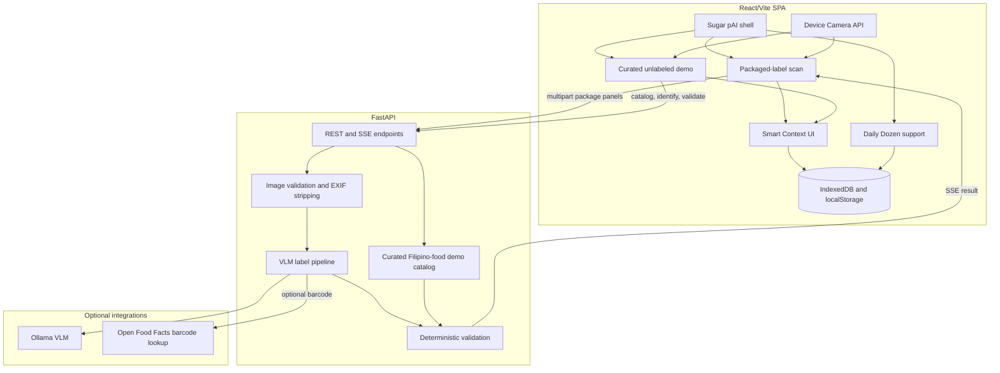
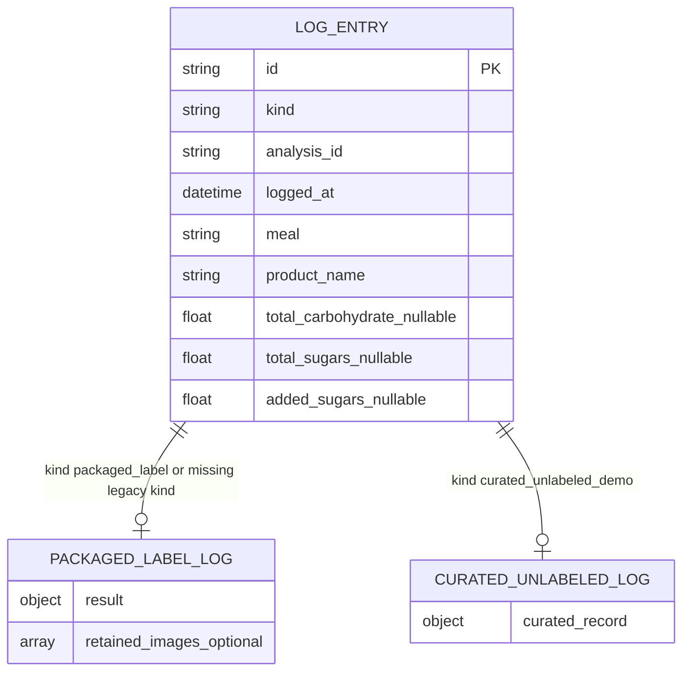

# System Architecture

Sugar pAI V2 uses a Vite/React SPA with a FastAPI backend. The product is local-first: the backend performs short-lived analysis and validation, while confirmed history is stored in browser IndexedDB.

## High-Level System Design

## Packaged-Label Data Flow

1. User captures Nutrition Facts, ingredients, front label, and optional barcode images.
2. Frontend quality checks run locally.
3. Frontend creates an analysis job with `POST /api/v1/analyses`.
4. Backend sanitizes uploads, runs the VLM pipeline, classifies ingredients, checks claims, and streams events.
5. User corrects draft evidence in the review screen.
6. Frontend finalizes with `POST /api/v1/analyses/{id}/finalize`.
7. Backend returns a confirmed `AnalysisResult`.
8. Frontend builds Smart Context and saves the local `packaged_label` log.

## Curated Unlabeled Demo Data Flow

1. User chooses **Unlabeled demo**.
2. Frontend loads `GET /api/v1/unlabeled-foods/catalog?market=PH`.
3. User may upload a food photo; `POST /api/v1/unlabeled-foods/identify` can suggest catalog candidates.
4. User confirms catalog food and portion manually.
5. Frontend validates with `POST /api/v1/unlabeled-food-records/validate`.
6. Backend returns a `CuratedFoodRecord` with qualitative tags, context flags, unavailable glycemic evidence, and limitations.
7. Frontend builds Smart Context and saves the local `curated_unlabeled_demo` log.

## Local Data Model

### IndexedDB

Database: `sugar-pai-research`

Store: `logs`

Log records are union-shaped:

Missing `kind` is treated as `packaged_label` for backward compatibility.

### localStorage

Daily Dozen support state and custom recipes remain local to the browser.

## Service Boundaries

- **FastAPI backend:** No durable database. Analysis jobs and uploads expire after 15 minutes.
- **Ollama:** Optional VLM provider for packaged-label extraction.
- **Open Food Facts:** Optional barcode lookup when enabled; community data never replaces current label evidence without review.
- **Curated catalog:** Static qualitative demo data only. It does not contain calories, macros, GI, GL, or FNRI-derived claims.

## Safety Boundary

Smart Context is deterministic educational context. It does not provide medical advice, medication guidance, insulin guidance, suitability claims, or glucose predictions.
