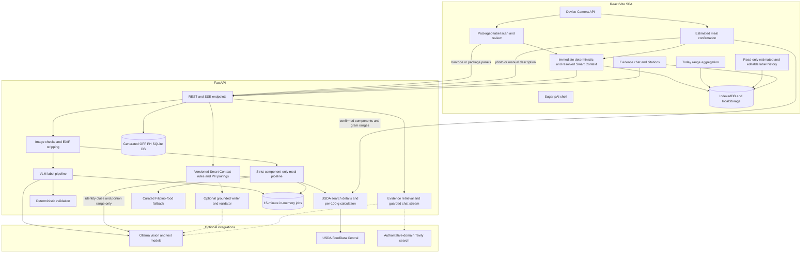
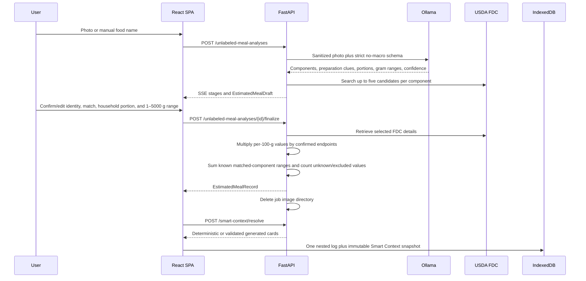
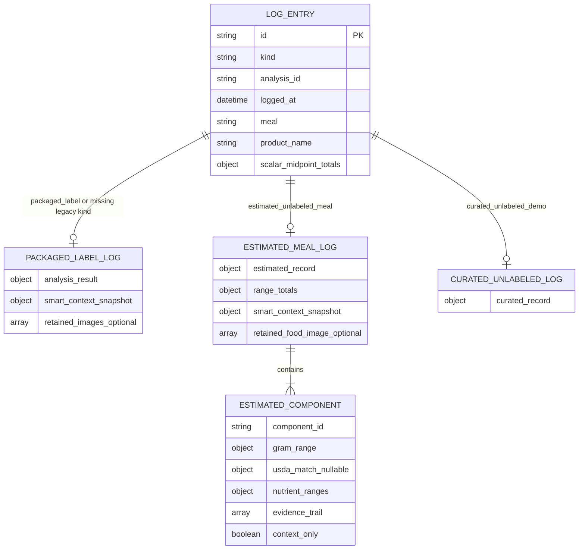

# System Architecture

Sugar pAI V2 uses a Vite/React SPA with a FastAPI backend. The product is local-first: FastAPI performs short-lived evidence processing, matching, calculation, and Smart Context resolution; confirmed records and source snapshots live in browser IndexedDB.

## High-Level System Design

## Evidence Resolution and Semantics

The system keeps decision logic deterministic and makes acquisition paths explicit:

1. User-confirmed photographed-label values (`observed`).
2. Exact local Open Food Facts barcode matches (`retrieved`).
3. Exact or user-selected USDA branded/generic matches (`retrieved`).
4. VLM food identity and portion proposals (`estimated`), never nutrient grams.
5. Curated qualitative descriptors (`contextual`) when numeric matching is unavailable.
6. Portion-range arithmetic and aggregates (`derived`).
7. Missing fields (`unavailable`), never implicit zero.

`EvidenceValue` preserves legacy `sourceKind`, status, evidence, confidence, conflict, and confirmation fields. It adds evidence type, optional numeric range, confidence band, timestamped evidence trail, and source metadata. Estimated components carry the same acquisition/correction/calculation history at component level.

## Packaged-Label Data Flow

1. The frontend checks a UPC/EAN through `GET /api/v1/off-products/{barcode}?market=PH`.
2. A complete local OFF record starts `POST /api/v1/analyses/barcode`; partial or missing records retain the package-panel capture path.
3. Image uploads are bounded, decoded, sanitized, re-encoded without EXIF, and placed in a short-lived job directory.
4. The backend uses local database evidence first and calls Ollama only for required photographed fields.
5. Ingredient taxonomy and deterministic nutrient/claim validation run before the result stream completes.
6. The user edits and finalizes with `POST /api/v1/analyses/{id}/finalize`; corrected values become user-confirmed observations.
7. The frontend renders existing deterministic cards immediately and calls `POST /api/v1/smart-context/resolve` asynchronously.
8. Only a validated backend response replaces the fallback. The log stores the selected card/source/provenance snapshot so History is reproducible.

## Estimated Unlabeled-Meal Data Flow

Key invariants:

- `DetectedMeal` rejects extra fields and more than 12 components. Macros in model output fail schema validation and trigger one correction retry.
- Each component has at most five USDA candidates.
- Only the backend retrieves USDA details; nutrient grams are never accepted from the VLM or arbitrary web text.
- Every confirmed component must have an identity, household portion, and finite ordered `1–5000 g` range. A component without a selected FDC record must be context-only.
- Missing USDA nutrients remain unknown. Known nutrient subtotals retain per-nutrient unknown counts.
- Aggregate ranges cover matched components only and always expose excluded-component count and `partial`.
- Estimated meals do not receive numeric GI/GL or personal glucose predictions.

## Smart Context Orchestration

1. FastAPI normalizes exact values or ranges and their provenance.
2. Versioned deterministic rules decide which cards trigger.
3. Estimated rules require the full range to support the threshold; crossing a boundary produces an uncertainty card.
4. Bundled evidence and constrained Philippine pairings resolve source/action IDs.
5. Optional Ollama writing receives only the allowed facts, cards, actions, and sources.
6. Validation rejects changed/duplicated rule IDs, evidence labels, actions, unknown sources, invented numbers, prohibited claims, and malformed JSON.
7. Timeout, retrieval failure, model failure, or validation failure returns deterministic cards.
8. Results are cached by normalized request and rule/evidence/pairing/writer/model versions. Responses expose `cacheHit` and fallback reason.

The writer cannot originate rule triggers, nutrient values, actions, or citations.

## Local Data Model

IndexedDB database: `sugar-pai-research`

- `logs`: packaged-label, legacy curated, and estimated-meal records.
- `chatThreads`: local chat messages, selected context, and source snapshots (schema version 2).

Exact package values are treated as fixed ranges when Today combines them with estimated ranges. Scalar estimated totals are retained only as compatibility/display midpoints; `rangeTotals` are authoritative. JSON export removes retained blobs. CSV includes midpoint, min, max, excluded count, and partial status.

Missing `kind` continues to mean `packaged_label`. Existing curated records require no migration. Estimated records are read-only in this release.

## Storage and Image Lifecycle

- The backend has no durable user database.
- Package and meal jobs live in process memory for at most 15 minutes.
- Estimated-meal finalize/delete removes its temporary directory immediately.
- Shutdown and expiry cleanup remove all remaining job directories.
- The frontend retains a source photo only after an explicit local opt-in; otherwise no blob enters IndexedDB.
- Telemetry includes latency, source path, cache hit, and fallback reason, but excludes images and raw user notes.

## Service Boundaries

- **Local OFF SQLite:** Static generated community-data evidence for `market=PH`; not user storage and not user-confirmed truth.
- **USDA FoodData Central:** Server-side search/details source for per-100-g nutrient data. API credentials never enter frontend code.
- **Ollama meal vision:** May identify foods and portion uncertainty but is schema-prohibited from producing nutrient grams.
- **Ollama Smart Context writer:** Optional wording layer; cannot select rules or introduce facts.
- **Curated catalog:** Static Philippine-relevant qualitative fallback; never a source of numeric nutrients.
- **Tavily:** Optional authoritative-domain retrieval for evidence chat. It is not a nutrient-gram source.
- **IndexedDB:** Durable local history and chat storage; clearing browser data removes it.

## Safety Boundary

Sugar pAI provides educational evidence context. It does not diagnose, treat, give medication/insulin guidance, decide food suitability, or predict an individual's glucose response. Estimated ranges are portion uncertainty—not laboratory, recipe, or population variance.
